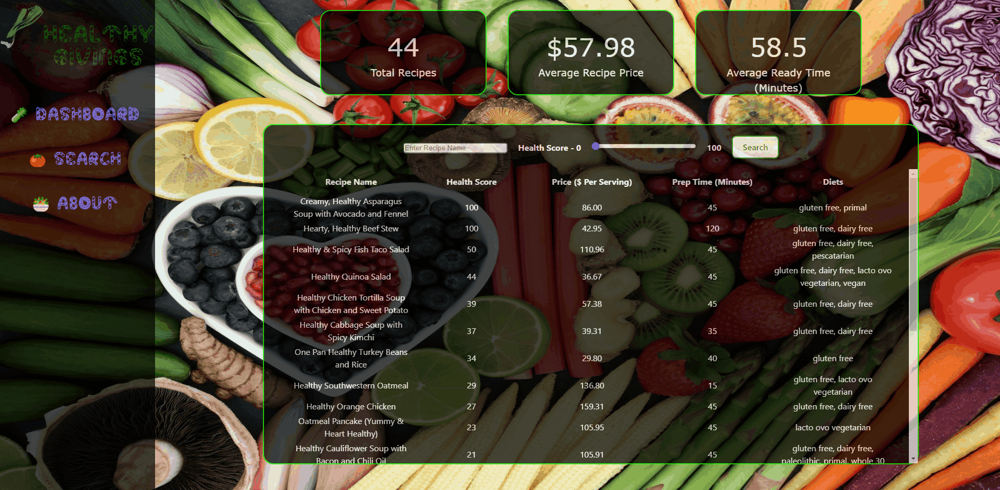

# Web Development Project 6 - *Healthy Givings*

Submitted by: **Josue Flores**

This web app: **A web application that utilizes the Spoonacular API to query/display results pertaining to healthy recipes coupled with details in respect to their Health Score, Cost, Preparation Time, and Diet and visual graphics illustrating relationships between certain variables**

Time spent: **30** hours spent in total

## Required Features

The following **required** functionality is completed:

- [X] **The app includes at least one unique chart developed using the fetched data that tell an interesting story**
- [X] **Clicking on an item in the list view displays more details about it**
- [X] **Clicking on an item has a direct, unique link to that item's detail view page**

The following **optional** features are implemented:

- [X] The site's customized dashboard contains more content that explains what is interesting about the data
- [ ] The site allows users to toggle between different data visualizations

## Video Walkthrough

Here's a walkthrough of implemented user stories:

<!--  imgur link - https://imgur.com/a/GU4LAvX  >

<!-- Replace this with whatever GIF tool you used! -->
GIF created with ScreenToGif 
<!-- Recommended tools:
[Kap](https://getkap.co/) for macOS
[ScreenToGif](https://www.screentogif.com/) for Windows
[peek](https://github.com/phw/peek) for Linux. -->

## Notes

Describe any challenges encountered while building the app.

- Limited API calls for the free tier
- Styling/Deciding on a Theme for the website
- Structuring the data from the API calls
- Choosing and learning an Appropriate Chart Library
- Passing state to the different Routes
- Formatting The Routes for the inclusion of an Outlet React Component

## License

    Copyright [2023] [Josue Flores]

    Licensed under the Apache License, Version 2.0 (the "License");
    you may not use this file except in compliance with the License.
    You may obtain a copy of the License at

        http://www.apache.org/licenses/LICENSE-2.0

    Unless required by applicable law or agreed to in writing, software
    distributed under the License is distributed on an "AS IS" BASIS,
    WITHOUT WARRANTIES OR CONDITIONS OF ANY KIND, either express or implied.
    See the License for the specific language governing permissions and
    limitations under the License.

<!-- # Web Development Project 5 - *Healthy Givings*

Submitted by: **Josue Flores**

This web app: **A web application that utilizes the Spoonacular API to query/display results pertaining to healthy recipes coupled with details in respect to their Health Score, Cost, Preparation Time, and Diet**

Time spent: *18* hours spent in total

## Required Features

The following **required** functionality is completed:

- [X] **The list displays a list of data fetched using an API call**
- [X] **Data uses the useEffect React hook and async/await syntax**
- [X] **The app dashboard includes at least three summary statistics about the data such as**
  - [X] *Total Number of Recipes*
  - [X] *Average ($) Price of Recipes*
  - [X] *Average Ready Time in Minutes*
- [X] **A search bar allows the user to search for an item in the fetched data**
- [X] **Multiple different filters (2+) allow the user to filter items in the database by specified categories**

The following **optional** features are implemented:

- [X] Multiple filters can be applied simultaneously
- [X] Filters use different input types such as a text input, a selection, or a slider
- [X] The user can enter specific bounds for filter values

## Video Walkthrough

Here's a walkthrough of implemented user stories:

<!--  Imgur link - https://imgur.com/a/seQa3oe>

<!-- Replace this with whatever GIF tool you used! -->
<!-- GIF created with ScreenToGif -->  
<!-- Recommended tools:
[Kap](https://getkap.co/) for macOS
[ScreenToGif](https://www.screentogif.com/) for Windows
[peek](https://github.com/phw/peek) for Linux. -->

<!--
## Notes

Describe any challenges encountered while building the app.

- Limited API calls for the free tier
- Styling/Deciding on a Theme for the website
- Structuring the data from the API calls

## License

    Copyright [2023] [Josue Flores]

    Licensed under the Apache License, Version 2.0 (the "License");
    you may not use this file except in compliance with the License.
    You may obtain a copy of the License at

        http://www.apache.org/licenses/LICENSE-2.0

    Unless required by applicable law or agreed to in writing, software
    distributed under the License is distributed on an "AS IS" BASIS,
    WITHOUT WARRANTIES OR CONDITIONS OF ANY KIND, either express or implied.
    See the License for the specific language governing permissions and
    limitations under the License. -->